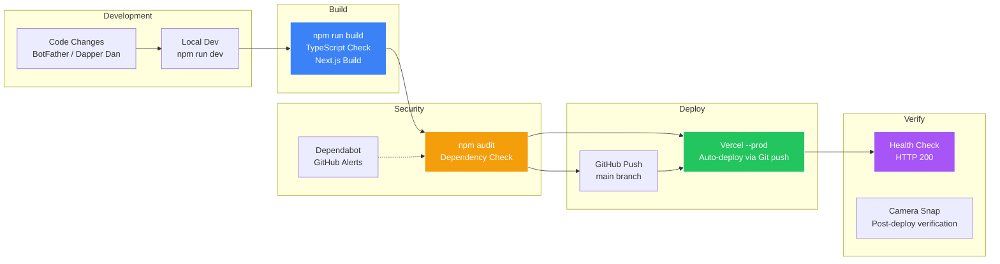

# OpenClaw Environment Map — La Famiglia

> Auto-generated by BotFather • Last updated: 2026-07-12

## System Architecture

```mermaid
graph TB
    subgraph "Pieró's Machine — Windows 11"
        subgraph "OpenClaw Gateway"
            GW[OpenClaw Gateway<br/>Port 18789<br/>Token Auth]
            CLI[openclaw CLI<br/>v2026.5.12]
        end

        subgraph "Channels"
            TG[Telegram Bot<br/>@OpenClaw Bot]
            WA[WhatsApp<br/>Pairing Mode]
        end

        subgraph "Primary Agent — Don BotFather"
            BF[main<br/>ollama/kimi-k2.6:cloud<br/>Boss of Bosses]
            BF_SOUL[SOUL.md<br/>IDENTITY.md<br/>MEMORY.md]
            BF_SKILLS[51 Skills]
        end

        subgraph "Active Capos"
            DD[dapper-dan<br/>Dapper Dan the Builder<br/>ollama/kimi-k2.7:cloud]
            BB[breaking-ben<br/>Benjamin "Bricks" Testa<br/>ollama/glm-5.1:cloud]
            CD[codex-developer<br/>Nico "The Architect" Codex<br/>ollama/glm-5.1:cloud]
            COS[chief-of-staff<br/>Consigliere Chief<br/>ollama/kimi-k2.7:cloud]
            MM[model-buzz-scout<br/>Mikey "The Ear" Models<br/>ollama/glm-5.1:cloud]
        end

        subgraph "Reference Specialists (On-Demand)"
            TB[Tony Blueprints<br/>Product Architecture]
            BEL[Bella Buttons<br/>UX Design]
            VV[Vinny Visuals<br/>Visual & Brand]
            NS[Nico Stack<br/>Architecture & Infra]
            JNB[Joey No-Bugs<br/>QA & Testing]
            SAL[Sal the Shield<br/>Security]
            FF[Frankie Fastlane<br/>Performance]
            RR[Rocco Rollout<br/>Release & Deploy]
            CC[Connie Consigliere<br/>Strategy]
        end

        subgraph "Cron Jobs — Active"
            C1[model-buzz-scout-weekly<br/>Sunday 8:00 AM ET]
            C2[Overnight Pipeline<br/>5 stages nightly]
            C3[Daily Status Report<br/>7:00 AM ET]
            C4[Morning Briefing<br/>7:30 AM ET]
            C5[Morning/Nightly Tech News]
            C6[Vinny Vault Weekly<br/>Sunday 9:00 AM ET]
            C7[3-Hour Check-In]
            C8[Proactive: 4x daily]
        end

        subgraph "Security & Monitoring"
            CAM[OBSBOT Tiny 4K<br/>Main Security Cam]
            SEC[Security Watchdog<br/>Port 3198]
            MOT[Motion Tracker<br/>Port 3197]
            CAMS[Camera Server<br/>Port 3199]
            TL[Timelapse Compiler<br/>Port 3201]
            SNAP[Periodic Reporter<br/>Port 3202]
        end

        subgraph "Data & Storage"
            WS[Workspace<br/>C:\Users\devpi\.openclaw\workspace]
            EXT[D: Extreme SSD<br/>~167 GB Free]
            MEM[Memory System<br/>Active Memory + Wiki]
            DAILY[daily notes/<br/>memory/YYYY-MM-DD.md]
        end

        subgraph "Deployments"
            VERCEL[Vercel<br/>7 projects linked]
            GH[GitHub<br/>Porfirio-Piero org]
        end
    end

    TG --> GW
    WA --> GW
    GW --> BF
    BF --> DD
    BF --> BB
    BF --> CD
    BF --> COS
    BF --> MM
    BF -.->|on demand| TB
    BF -.->|on demand| BEL
    BF -.->|on demand| VV
    BF -.->|on demand| NS
    BF -.->|on demand| JNB
    BF -.->|on demand| SAL
    BF -.->|on demand| FF
    BF -.->|on demand| RR
    BF -.->|on demand| CC

    CAM --> SEC
    CAM --> MOT
    CAM --> CAMS
    CAM --> TL
    CAM --> SNAP

    BF --> WS
    BF --> MEM
    BF --> DAILY

    BF --> VERCEL
    BF --> GH
```

## Agent Hierarchy

```mermaid
graph TD
    P[Piero Porfirio<br/>Owner] --> BF[Don BotFather<br/>Primary Orchestrator]

    BF --> DD[Dapper Dan the Builder<br/>Construction Capo<br/>Kimi K2.7-Code Cloud]
    BF --> BB[Benjamin "Bricks" Testa<br/>Demolition & QA Capo<br/>GLM 5.1 Cloud]
    BF --> CD[Nico "The Architect" Codex<br/>Architecture Capo<br/>GLM 5.1 Cloud]
    BF --> COS[Consigliere Chief<br/>Coordination Capo<br/>Kimi K2.7-Code Cloud]
    BF --> MM[Mikey "The Ear" Models<br/>Intelligence Scout<br/>GLM 5.1 Cloud]

    BF -.->|delegate| TB[Tony Blueprints<br/>Product Architecture]
    BF -.->|delegate| BEL[Bella Buttons<br/>UX & Interface Design]
    BF -.->|delegate| VV[Vinny Visuals<br/>Visual & Brand Review]
    BF -.->|delegate| NS[Nico Stack<br/>Architecture & Infra]
    BF -.->|delegate| JNB[Joey No-Bugs<br/>QA & Testing]
    BF -.->|delegate| SAL[Sal the Shield<br/>Security Review]
    BF -.->|delegate| FF[Frankie Fastlane<br/>Performance]
    BF -.->|delegate| RR[Rocco Rollout<br/>Release & Deployment]
    BF -.->|delegate| CC[Connie Consigliere<br/>Strategy & Agent Design]

    style BF fill:#e94560,stroke:#fff,color:#fff
    style DD fill:#3b82f6,stroke:#fff,color:#fff
    style BB fill:#f59e0b,stroke:#fff,color:#fff
    style CD fill:#a855f7,stroke:#fff,color:#fff
    style COS fill:#22c55e,stroke:#fff,color:#fff
    style MM fill:#6366f1,stroke:#fff,color:#fff
```

## Build → Test → Security → Deploy Pipeline



## Skill Map — 51 Workspace Skills + 14 Platform Skills

```
workspace/skills/
├── action-tracker/          # Track action items
├── api-integration/         # API integration patterns
├── botfather/               # BotFather persona
├── breaking-ben/            # Breaking Ben persona
├── calendar-sync/           # Google Calendar sync
├── cc-godmode/              # God mode utilities
├── chief-of-staff/          # Chief of Staff persona
├── codex-developer/         # Codex Developer persona
├── context-anchor/          # Context preservation
├── daily-briefing/          # Morning briefing
├── dapper-dan/              # Dapper Dan persona
├── data-analysis/           # Data analysis
├── database/                # Database operations
├── devops/                  # DevOps operations
├── document/                # Document handling
├── email/                   # Email integration
├── lead-researcher/         # Lead research
├── memory/                  # Memory management
├── ollama-local/            # Ollama local models
├── ollama-memory-embeddings/ # Memory embeddings
├── openclaw-stealth-browser/ # Stealth browser
├── overnight-complexity-validator/ # Overnight validation
├── overnight-development-checkpoints/ # Build checkpoints
├── proactive-soul/          # Proactive behavior
├── scheduler/               # Task scheduling
├── security/                # Security operations
├── skill-vetter/            # Skill vetting
├── swarmclaw/               # Swarm orchestration
├── tavily/                  # Tavily search
├── testing/                 # Testing framework
├── uptime-kuma/             # Uptime monitoring
├── web-research/            # Web research
├── weekly-model-intelligence/ # Model buzz scout
└── wiki-system/             # Wiki maintenance

platform/ai-engineering/skills/
├── product-discovery/       # Product discovery
├── design-system/           # Design system review
├── ux-quality/              # UX quality
├── fullstack-engineering/   # Full-stack engineering
├── visual-review/           # Visual review
├── accessibility/           # Accessibility review
├── testing-quality/         # Testing quality
├── security-review/         # Security review
├── performance-review/      # Performance review
├── release-governance/      # Release governance
├── context-preservation/    # Context preservation
├── agent-evolution/         # Agent evolution
├── personality-craft/        # Personality crafting
└── weekly-model-intelligence/ # Weekly model intel
```

## Identity Files (The Boss's Memory)

| File | Purpose | Size |
|------|---------|------|
| SOUL.md | Who I am, personality, principles | ~4 KB |
| IDENTITY.md | Speech patterns, models, delegation | ~3 KB |
| MEMORY.md | Long-term memory, project history | ~25 KB |
| AGENTS.md | Fleet config, routing rules | ~7 KB |
| USER.md | About Piero, preferences, household | ~2 KB |
| TOOLS.md | Camera config, scripts, environment | ~6 KB |
| COMPANY.md | Autonomous company doctrine | ~5 KB |
| HEARTBEAT.md | Status schedule, security checks | ~4 KB |
| CURIOSITY.md | Open threads, things I'm thinking about | ~2 KB |

## Key File Locations

| Item | Path |
|------|------|
| OpenClaw Config | `~/.openclaw/openclaw.json` |
| Cron Jobs | `~/.openclaw/cron/jobs.json` |
| Agent Definitions | `~/.openclaw/agents/*/AGENT.md` |
| Agent Personality | `~/.openclaw/agents/*/BEHAVIOR.md` + `PHRASES.md` |
| Platform Standards | `workspace/platform/ai-engineering/standards/` |
| Platform Skills | `workspace/platform/ai-engineering/skills/` |
| Workspace Skills | `workspace/skills/*/SKILL.md` |
| Memory Daily Notes | `workspace/memory/YYYY-MM-DD.md` |
| Camera Scripts | `workspace/camera-tools/` |
| Camera Storage | `D:\camera\` (external SSD) |
| Vinny Vault | `workspace/vinny-vault/` |
| Consiglio Dashboard | `workspace/consiglio-dashboard/` |

## Security Notes

- **Snyk**: NOT installed (gap in pipeline)
- **npm audit**: Available per project
- **Dependabot**: Enabled via GitHub
- **Docker**: Not installed on this machine
- **Deployment**: Vercel (auto-deploy via git push) or manual `npx vercel --prod`
- **Camera Security**: OBSBOT armed 24/7, motion detection, timelapse
- **Never reboot the machine**