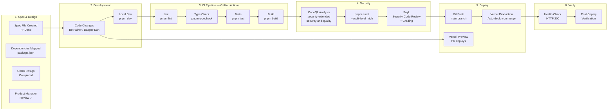

# OpenClaw Environment Map — La Famiglia

> Auto-generated by BotFather • Last updated: 2026-07-12

## System Architecture

```mermaid
graph TB
    subgraph "Pieró's Machine — Windows 11"
        subgraph "OpenClaw Gateway"
            GW[OpenClaw Gateway<br/>Port 18789<br/>Token Auth]
            CLI[openclaw CLI<br/>v2026.5.12]
        end

        subgraph "Channels"
            TG[Telegram Bot<br/>@OpenClaw Bot<br/>DM Policy: Open]
            WA[WhatsApp<br/>Pairing Mode]
        end

        subgraph "Primary Agent — Don BotFather"
            BF[main<br/>ollama/kimi-k2.6:cloud<br/>Boss of Bosses]
            BF_FILES[SOUL.md • IDENTITY.md • MEMORY.md<br/>AGENTS.md • USER.md • TOOLS.md<br/>COMPANY.md • HEARTBEAT.md • CURIOSITY.md]
            BF_SKILLS[51 Workspace Skills<br/>14 Platform Skills]
        end

        subgraph "Active Capos"
            DD[dapper-dan<br/>Dapper Dan the Builder<br/>ollama/kimi-k2.7-code:cloud<br/>BEHAVIOR.md + PHRASES.md]
            BB[breaking-ben<br/>Benjamin Bricks Testa<br/>ollama/glm-5.1:cloud<br/>BEHAVIOR.md + PHRASES.md]
            CD[codex-developer<br/>Nico the Architect Codex<br/>ollama/glm-5.1:cloud<br/>BEHAVIOR.md + PHRASES.md]
            COS[chief-of-staff<br/>Consigliere Chief<br/>ollama/kimi-k2.7-code:cloud<br/>BEHAVIOR.md + PHRASES.md]
            MM[model-buzz-scout<br/>Mikey the Ear Models<br/>ollama/glm-5.1:cloud<br/>BEHAVIOR.md + PHRASES.md]
        end

        subgraph "Reference Specialists — On Demand"
            TB[Tony Blueprints<br/>Product Architecture]
            BEL[Bella Buttons<br/>UX Design]
            VV[Vinny Visuals<br/>Visual & Brand]
            NS[Nico Stack<br/>Architecture & Infra]
            JNB[Joey No-Bugs<br/>QA & Testing]
            SAL[Sal the Shield<br/>Security]
            FF[Frankie Fastlane<br/>Performance]
            RR[Rocco Rollout<br/>Release & Deploy]
            CC[Connie Consigliere<br/>Strategy]
        end

        subgraph "Cron Jobs — 8 Active"
            C1[model-buzz-scout-weekly<br/>Sun 8:00 AM ET]
            C2[Overnight Pipeline<br/>Nightly 5 stages]
            C3[Daily Status<br/>7:00 AM ET]
            C4[Morning Briefing<br/>7:30 AM ET Weekdays]
            C5[Tech News<br/>3x daily]
            C6[Vinny Vault Weekly<br/>Sun 9:00 AM ET]
            C7[3-Hour Check-In]
            C8[Proactive: 4x daily]
        end

        subgraph "Security & Monitoring"
            CAM[OBSBOT Tiny 4K<br/>Main Security Cam]
            SEC[Watchdog :3198]
            MOT[Motion Tracker :3197]
            CAMS[Camera Server :3199]
            TL[Timelapse :3201]
            SNAP[Periodic Reporter :3202]
            STREAM[Live MJPEG :3200]
        end

        subgraph "Data & Storage"
            WS[Workspace<br/>~/.openclaw/workspace/]
            EXT[D: Extreme SSD<br/>~167 GB Free]
            MEM[Active Memory + Wiki<br/>Local Embedding Search]
            DAILY[memory/YYYY-MM-DD.md<br/>Daily notes]
        end
    end

    subgraph "CI/CD Pipeline — GitHub Actions"
        GH[GitHub<br/>Porfirio-Piero org]
        GHA[GitHub Actions<br/>ci-cd-vercel.yml]
        CQL[CodeQL Analysis<br/>Security + Quality]
        AUDIT[pnpm audit<br/>Dependency Audit]
        VPREV[Vercel Preview<br/>PR deploys]
        VPROD[Vercel Production<br/>Main branch]
    end

    TG --> GW
    WA --> GW
    GW --> BF
    BF --> DD & BB & CD & COS & MM
    BF -.->|on demand| TB & BEL & VV & NS & JNB & SAL & FF & RR & CC

    CAM --> SEC & MOT & CAMS & TL & SNAP & STREAM
    BF --> WS & MEM & DAILY

    BF --> GH
    GH --> GHA
    GHA --> CQL & AUDIT
    GHA --> VPREV
    GHA --> VPROD
```

## Build → Test → Security → Deploy Pipeline

## Agent Hierarchy

```mermaid
graph TD
    P[Piero Porfirio<br/>Owner] --> BF[Don BotFather<br/>Primary Orchestrator]

    BF --> DD[Dapper Dan the Builder<br/>Construction Capo<br/>Kimi K2.7-Code Cloud]
    BF --> BB[Benjamin Bricks Testa<br/>Demolition & QA Capo<br/>GLM 5.1 Cloud]
    BF --> CD[Nico the Architect Codex<br/>Architecture Capo<br/>GLM 5.1 Cloud]
    BF --> COS[Consigliere Chief<br/>Coordination Capo<br/>Kimi K2.7-Code Cloud]
    BF --> MM[Mikey the Ear Models<br/>Intelligence Scout<br/>GLM 5.1 Cloud]

    BF -.->|delegate| TB[Tony Blueprints<br/>Product Architecture]
    BF -.->|delegate| BEL[Bella Buttons<br/>UX & Interface Design]
    BF -.->|delegate| VV[Vinny Visuals<br/>Visual & Brand Review]
    BF -.->|delegate| NS[Nico Stack<br/>Architecture & Infra]
    BF -.->|delegate| JNB[Joey No-Bugs<br/>QA & Testing]
    BF -.->|delegate| SAL[Sal the Shield<br/>Security Review]
    BF -.->|delegate| FF[Frankie Fastlane<br/>Performance]
    BF -.->|delegate| RR[Rocco Rollout<br/>Release & Deployment]
    BF -.->|delegate| CC[Connie Consigliere<br/>Strategy & Agent Design]

    style BF fill:#e94560,stroke:#fff,color:#fff
    style DD fill:#3b82f6,stroke:#fff,color:#fff
    style BB fill:#f59e0b,stroke:#fff,color:#fff
    style CD fill:#a855f7,stroke:#fff,color:#fff
    style COS fill:#22c55e,stroke:#fff,color:#fff
    style MM fill:#6366f1,stroke:#fff,color:#fff
```

## CI/CD Pipeline Details

### GitHub Actions Workflow: `ci-cd-vercel.yml`

**Triggers:** Push to main, Pull Requests, Manual dispatch

**Jobs:**

| Job | Purpose | Details |
|-----|---------|---------|
| **CI Pipeline** | Lint → Type Check → Test → Build | pnpm install, lint, typecheck, test, build |
| **CodeQL Analysis** | Security scanning | `security-extended` + `security-and-quality` queries |
| **Dependency Audit** | Dependency vulnerability check | `pnpm audit --audit-level=high` |
| **Vercel Preview** | PR deployments | Deploy preview on pull requests |
| **Vercel Production** | Production deployment | Deploy on merge to main |
| **Summary** | Pipeline status | Aggregates all job results |

**Security Scanning:**
- ✅ CodeQL (GitHub native) — JavaScript/TypeScript analysis
- ✅ pnpm audit — dependency vulnerability scanning
- ⚠️ Snyk — NOT YET INSTALLED (needs `snyk` CLI + auth token)
- ✅ GitHub Dependabot — automated dependency updates

**Deployment Flow:**
1. Spec → Dependencies → UI/UX Design → PM Review
2. Code changes pushed to feature branch
3. GitHub Actions runs: lint → typecheck → test → build → CodeQL → audit
4. On PR: Vercel preview deploy with comment on PR
5. On merge to main: Vercel production deploy with health check
6. Post-deploy verification (HTTP 200 check)

## Key File Locations

| Item | Path |
|------|------|
| OpenClaw Config | `~/.openclaw/openclaw.json` |
| Cron Jobs | `~/.openclaw/cron/jobs.json` |
| Agent Definitions | `~/.openclaw/agents/*/AGENT.md` |
| Agent Personality | `~/.openclaw/agents/*/BEHAVIOR.md` + `PHRASES.md` |
| Platform Standards | `workspace/platform/ai-engineering/standards/` |
| Platform Skills | `workspace/platform/ai-engineering/skills/` |
| Workspace Skills | `workspace/skills/*/SKILL.md` |
| CI/CD Workflow | `workspace/.github/workflows/ci-cd-vercel.yml` |
| Memory Daily Notes | `workspace/memory/YYYY-MM-DD.md` |
| Camera Scripts | `workspace/camera-tools/` |
| Camera Storage | `D:\camera\` (external SSD) |
| Vinny Vault | `workspace/vinny-vault/` |
| Consiglio Dashboard | `workspace/consiglio-dashboard/` |
| Environment Map | `workspace/ENVIRONMENT-MAP.md` |
| Onboarding Guide | `workspace/NEW-AGENT-ONBOARDING.md` |

## Vercel Projects (107 linked)

Business sites, SaaS products, and tools — all deployed via Vercel with auto-deploy on git push.

**Active SaaS Products:**
- Consiglio Dashboard (command center)
- Norm Is Right
- Context Switch
- FollowUpFlow
- LandlordMinder
- Liar or Fire
- InvoiceSnap
- CartClaw Lite
- TaskRhythm
- CompliancePulse

**Security Notes:**
- Snyk: NOT YET INSTALLED (gap — needs `npm install -g snyk` + auth)
- Docker: NOT INSTALLED on this machine
- Camera: OBSBOT armed 24/7 with motion detection
- **Never reboot the machine**