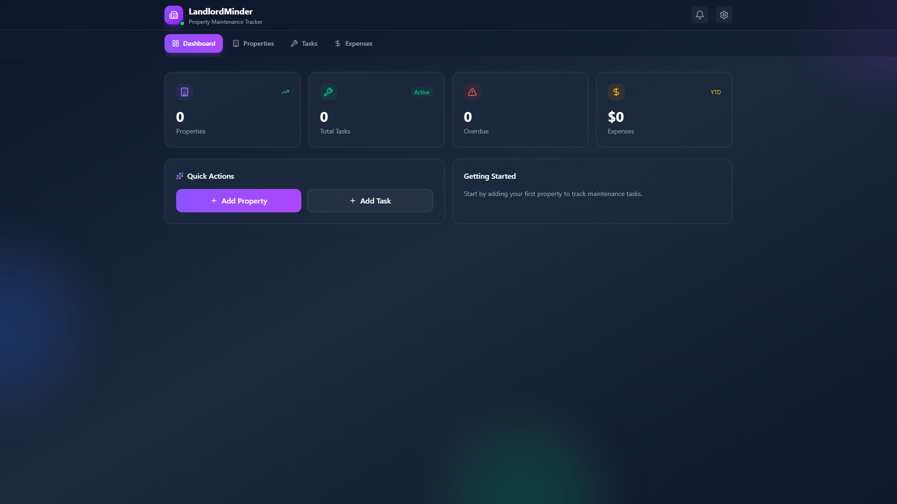

# LandlordMinder App

<div align="center">
  
  
  **Smart property management reminders for landlords**
  
  [](https://landlordminder-app.vercel.app)
  [](https://nextjs.org)
  [](https://react.dev)
  [](https://tailwindcss.com)
  [](https://playwright.dev/)
</div>

---

## 📸 Screenshots

| Dashboard | Property Management |
|-----------|---------------------|
|  | Manage your properties with ease |

---

## 🎯 About

**LandlordMinder App** is a smart property management reminder system for landlords. Never miss a rent payment, maintenance task, or lease renewal again.

---

## ✨ Features

| Feature | Description |
|---------|-------------|
| **🏠 Property Management** | Track multiple properties and tenants |
| **📅 Reminders** | Automated reminders for rent, maintenance, and leases |
| **💰 Payment Tracking** | Track rent payments and outstanding balances |
| **🔧 Maintenance Logs** | Keep track of repairs and maintenance |
| **📊 Dashboard** | Overview of all properties at a glance |
| **📱 Mobile Responsive** | Works on all devices |
| **🧪 E2E Tested** | Comprehensive Playwright test coverage |

---

## 🚀 Getting Started

### Prerequisites

- Node.js 22+
- npm or pnpm

### Installation

1. **Clone the repository**
   ```bash
   git clone https://github.com/Porfirio-Piero/landlordminder-app.git
   cd landlordminder-app
   ```

2. **Install dependencies**
   ```bash
   npm install
   ```

3. **Start the development server**
   ```bash
   npm run dev
   ```

4. **Open your browser**
   Navigate to [http://localhost:3000](http://localhost:3000)

---

## 📁 Project Structure

```
landlordminder-app/
├── src/
│   ├── app/              # Next.js App Router
│   │   ├── page.tsx      # Main dashboard
│   │   ├── layout.tsx    # Root layout
│   │   └── globals.css   # Global styles
│   ├── components/       # React components
│   │   └── ui/           # UI components
│   └── lib/              # Utilities
├── tests/                # Playwright tests
│   └── e2e/              # End-to-end tests
└── playwright.config.ts   # Playwright configuration
```

---

## 🛠️ Tech Stack

| Category | Technology |
|----------|------------|
| **Framework** | Next.js 16 (App Router) |
| **Language** | TypeScript 5 |
| **UI Library** | React 19 |
| **Styling** | Tailwind CSS 4 |
| **Icons** | Lucide React |
| **Testing** | Playwright |
| **Deployment** | Vercel |

---

## 🧪 Testing

```bash
# Run E2E tests
npm run test

# Run tests in UI mode
npm run test:ui

# Run tests in headed mode
npm run test:headed

# Debug tests
npm run test:debug

# View test report
npm run test:report
```

---

## 🚢 Deployment

### Vercel (Recommended)

1. **Push to GitHub**
   ```bash
   git push origin main
   ```

2. **Connect to Vercel**
   - Import your repository on Vercel
   - Deploy!

---

## 🗺️ Roadmap

- [ ] Tenant portal
- [ ] Payment integration (Stripe)
- [ ] Document storage
- [ ] Email/SMS notifications
- [ ] Multi-user support
- [ ] Financial reports

---

## 🤝 Contributing

Contributions are welcome! Please feel free to submit a Pull Request.

---

## 📄 License

MIT License - feel free to use this for your own property management!

---

## 🙏 Acknowledgments

- [Next.js](https://nextjs.org/) - The React Framework
- [Tailwind CSS](https://tailwindcss.com/) - Utility-first CSS
- [Playwright](https://playwright.dev/) - End-to-end testing

---

<div align="center">
  Made with ❤️ by <a href="https://github.com/Porfirio-Piero">Porfirio-Piero</a>
  
  **[⬆ Back to Top](#landlordminder-app)**
</div>